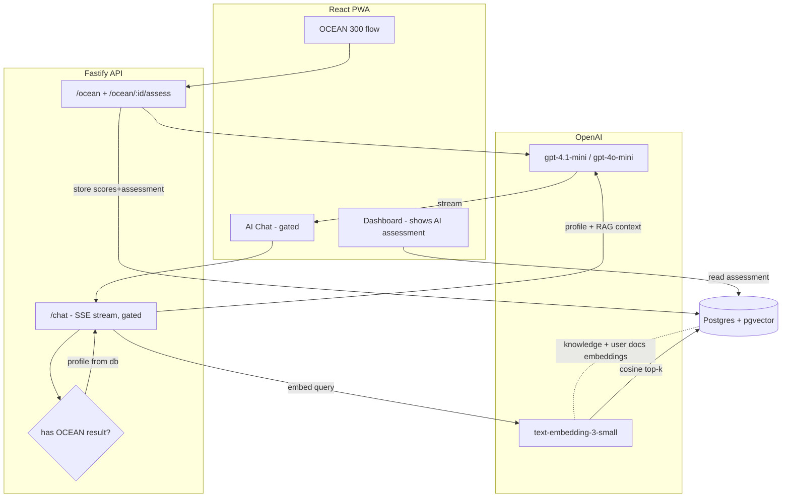

# Self-Authoring AI Integration Plan (OpenAI + RAG)

## Goal
Add an OpenAI-powered coaching chat to the app that is **only unlocked after a user completes the 300-item OCEAN questionnaire**. On completion, the AI assesses the Big Five data, generates a personality assessment, saves it to the user's profile, and surfaces it on the home dashboard. The chat is personalized with the user's profile and grounded in the Self-Authoring methodology (and optionally the user's own writings) via RAG.

This plan is grounded in the existing stack: Fastify + Prisma + Postgres + JWT (API) and React + Vite + Zustand + Tailwind + React Router (web), in a pnpm monorepo with `packages/shared`.

## Key research finding that shapes the design
The most important decision is **how user data reaches the model**. Per OpenAI's "Context Engineering for Personalization" cookbook and the 2026 RAG-vs-Memory consensus, split it into two distinct mechanisms:

- **Personality data = "memory/state", NOT RAG.** OCEAN scores and the AI assessment are small, authoritative, structured facts about *this* user. Inject them directly into the **system prompt** inside explicit tags (e.g. `<user_profile>`) with a precedence policy. RAG's semantic search is brittle for this — it can silently fail to retrieve the profile, miss overrides, and mishandle conflicts.
- **Program knowledge + the user's own writings = RAG.** The Self-Authoring methodology text, trait explanations, fault/virtue item descriptions, and the user's Past/Future/Faults/Virtues documents form a larger, growing corpus best fetched on demand via vector similarity.

Final chat prompt = `system(role + <user_profile> + <memory_policy>)` + `retrieved_context(RAG)` + `conversation`. This is the production-viable "use both" pattern.

For RAG storage, reuse the existing Postgres with **pgvector** (no separate vector DB): Prisma `Unsupported("vector(1536)")`, raw SQL for insert/query, an HNSW index, OpenAI `text-embedding-3-small` (1536 dims), cosine distance (`<=>`).

## Architecture overview



## Phase 0 — Foundations (shared infra)
1. **OpenAI client**: add `openai` to `apps/api`. New `apps/api/src/ai/openai.ts` exporting a configured client. Add `OPENAI_API_KEY` (and optional `OPENAI_CHAT_MODEL`, `OPENAI_EMBED_MODEL`) to `.env` and to the `api` service env in `app/docker-compose.yml`.
2. **pgvector**: switch the Postgres image to one with pgvector (e.g. `pgvector/pgvector:pg16`) in `docker-compose.yml`. Add a custom Prisma migration that runs `CREATE EXTENSION IF NOT EXISTS vector;`.
3. **Shared types**: extend `packages/shared/src/index.ts` with `OceanAssessment`, `ChatMessage`, `ChatRole`, and `UserProfileState` (the compact memory object) so web + api stay in sync.

## Phase 1 — AI OCEAN assessment (generate, save, show on home)

**Schema (`schema.prisma`)** — add the assessment to each result and a canonical profile on the user:

```prisma
model OceanResult {
  // ...existing fields...
  assessment Json?   // AI-generated narrative for this result
}

model UserProfile {
  id            String   @id @default(cuid())
  userId        String   @unique
  user          User     @relation(fields: [userId], references: [id], onDelete: Cascade)
  state         Json     // compact memory object injected into chat system prompt
  assessment    Json     // latest full assessment (shown on home)
  oceanResultId String
  updatedAt     DateTime @updatedAt
}
```

**Generation flow** (`apps/api/src/ai/assessment.ts`):
- Use **Structured Outputs** (JSON schema) for a reliably shaped result: `overallSummary`, per-trait `{ trait, interpretation }`, `strengths[]`, `growthAreas[]`, `recommendedModule` (which Self-Authoring program to start with), and a short `chatPersona` blurb.
- Input to the model: the computed `OceanScores` (scores, bands, plasticity/stability) + canonical trait definitions from `TRAIT_DESCRIPTIONS`.
- Build the compact `UserProfileState` from scores + assessment for later chat injection.

**Endpoint design** — keep submit fast and make assessment retriable:
- `POST /ocean` stays as-is (computes + stores scores, returns id).
- New `POST /ocean/:id/assess` (idempotent): generates the assessment via OpenAI, stores it on `OceanResult.assessment`, upserts `UserProfile`, returns the assessment. Avoids a 10-15s blocking submit; UI shows "Generating your assessment…" with retry on failure.

**Frontend**:
- After the OCEAN flow finishes, call `/ocean/:id/assess`, show a loading state, then render the narrative on the results page.
- **Dashboard**: add a prominent "Your Personality Profile" card at the top reading from `UserProfile.assessment` (summary + strengths/growth + recommended next module) — satisfies "show it on homescreen".

## Phase 2 — Gating the chat behind OCEAN completion
- **Gate rule**: chat is available iff the user has a `UserProfile` (completed OCEAN *and* assessment generated).
- **Server**: a `requireOceanComplete` preHandler (after `requireAuth`) on all `/chat` routes → 403 with a clear code if no profile.
- **Client**: `App.tsx` adds a `/chat` route guarded by both `PrivateRoute` and a new `OceanGate` wrapper that redirects to `/ocean` if no profile. The chat nav item shows a lock/"Complete OCEAN to unlock" state until then.

## Phase 3 — The chat (personalized via memory pattern)

**Schema**:

```prisma
model ChatMessage {
  id        String   @id @default(cuid())
  userId    String
  user      User     @relation(fields: [userId], references: [id], onDelete: Cascade)
  role      String   // 'user' | 'assistant'
  content   String
  createdAt DateTime @default(now())
  @@index([userId, createdAt])
}
```

(Single rolling conversation per user keeps it simple; can split into sessions later.)

**Prompt assembly** (`apps/api/src/ai/chat.ts`):

```
system:
  <role>  You are a Self-Authoring coach...
  <user_profile>  (YAML: OCEAN scores, bands, assessment summary, strengths, growth)
  <memory_policy>  latest user instruction wins; profile is trusted; do not over-apply
  <retrieved_context>  (RAG chunks, see Phase 4)
messages: last N turns from ChatMessage
```

**Endpoints**:
- `POST /chat` — accepts a message, embeds it, runs RAG retrieval, assembles the prompt, **streams** the completion back via SSE, persists both user + assistant messages.
- `GET /chat` — returns history.

**Frontend**: new `ChatPage.tsx` + a `useChatStore` (Zustand) consuming the SSE stream; Tailwind chat UI (message bubbles, streaming text, auto-scroll), plus a bottom-nav entry.

## Phase 4 — RAG (pgvector)

**Schema** (raw-SQL backed, since Prisma can't express `vector`):

```prisma
model KnowledgeChunk {
  id        String                 @id @default(cuid())
  source    String                 // 'program' | 'authoring'
  userId    String?                // null for global program content
  module    String?                // which doc/section
  content   String
  embedding Unsupported("vector(1536)")
  metadata  Json     @default("{}")
  createdAt DateTime @default(now())
  @@index([userId])
}
```

Plus a custom migration adding the HNSW index:
`CREATE INDEX ON "KnowledgeChunk" USING hnsw (embedding vector_cosine_ops);`

**Two corpora:**
1. **Program knowledge (global, seeded once)** — chunk and embed `TRAIT_DESCRIPTIONS` + trait labels, the fault/virtue item texts (`ocean-items.json`), and the Self-Authoring instructional/methodology text from `self-authoring+scraper/...` collections. A seed script `apps/api/src/ai/seed-knowledge.ts` chunks (~500 tokens), embeds with `text-embedding-3-small`, bulk-inserts via `$executeRaw`.
2. **User writings (per-user, kept fresh)** — hook into existing `PUT /authoring/:module`: after upsert, re-embed that module's text into `KnowledgeChunk` (delete old rows for `userId+module`, insert new). Lets the coach reference what the user actually wrote in Past/Future/Faults/Virtues.

**Retrieval** (`apps/api/src/ai/retrieval.ts`): embed the user's message, then one raw cosine query over the user's own chunks **plus** global program chunks:

```sql
SELECT content, metadata, 1 - (embedding <=> $1::vector) AS similarity
FROM "KnowledgeChunk"
WHERE "userId" IS NULL OR "userId" = $2
ORDER BY embedding <=> $1::vector
LIMIT 6;
```

Top-k chunks go into `<retrieved_context>`. Add a similarity threshold so low-relevance chunks are dropped — avoids polluting the prompt for off-topic questions.

## Cross-cutting decisions (recommended defaults)
- **Models**: `gpt-4.1-mini` (or `gpt-4o-mini`) for chat + assessment (cheap, fast, supports structured outputs + streaming); `text-embedding-3-small` for embeddings.
- **Cost/safety**: cap conversation history length, cap RAG to top-6 chunks, and keep the assessment endpoint idempotent (don't regenerate/charge on every page load).
- **Failure isolation**: OCEAN scoring never depends on OpenAI — if assessment generation fails, scores are still saved and assessment is retriable.
- **Secrets**: `OPENAI_API_KEY` via env only; never sent to the client. All AI calls are server-side.

## Implementation todo list
1. Add `openai` dep, OpenAI client, env wiring (`.env` + docker-compose), swap Postgres image to pgvector, add `CREATE EXTENSION vector` migration.
2. Extend shared types (`OceanAssessment`, `ChatMessage`, `UserProfileState`).
3. Schema: add `OceanResult.assessment`, `UserProfile`, `ChatMessage`, `KnowledgeChunk` (+ HNSW index migration); run migrate.
4. Build assessment generator (structured outputs) + `POST /ocean/:id/assess`; upsert `UserProfile`.
5. Frontend: assessment loading/render on results page + "Personality Profile" card on dashboard.
6. Chat gating: server preHandler + client `OceanGate` + locked nav state.
7. Knowledge seed script (program corpus) + per-user re-embed hook in `PUT /authoring/:module`.
8. Retrieval module (cosine top-k, threshold) + chat prompt assembly (profile memory + RAG + history).
9. `POST /chat` (SSE streaming, persists messages) + `GET /chat`.
10. Chat UI (`ChatPage`, `useChatStore`, streaming, bottom-nav entry).

## Open questions
1. **RAG scope** — include the user's own authoring writings (more powerful, adds re-embed-on-save complexity in step 7), or only program/methodology content?
2. **Assessment timing** — generate synchronously after the OCEAN flow with a loading screen (planned default), or on-demand on first dashboard open?
