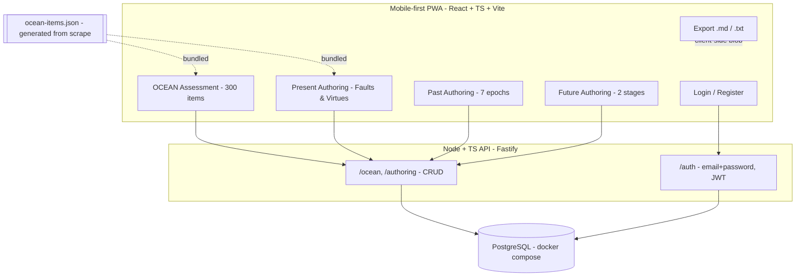

# Self-Authoring OCEAN App - Implementation Plan

## Overview
A mobile-first PWA (React + TypeScript) with a Node + TypeScript API and a Dockerized PostgreSQL database that lets a logged-in user take the full 300-item Big Five (OCEAN) assessment, work through all four Self-Authoring modules (Past, Present-Faults, Present-Virtues, Future), and export any results as `.md` or `.txt`.

## Goal
A mobile-first web app where a user can: (1) create an account (email + password, no verification), (2) take the full 300-item OCEAN assessment and see their Big Five results, (3) complete the four Self-Authoring programs as guided writing exercises, and (4) export any result as `.md` or `.txt`. Data persists in a Dockerized PostgreSQL DB behind a Node/TypeScript API on the user's own server.

## Architecture

## Tech Stack
- Frontend: React + TypeScript + Vite, React Router, Tailwind CSS, Zustand for state, PWA (installable, offline shell). Mobile-first layout with bottom tab navigation.
- Backend: Node.js + TypeScript, Fastify, Zod for validation, Prisma ORM, `bcrypt` for password hashing, `jsonwebtoken` for JWT auth.
- Database: PostgreSQL via `docker-compose.yml`.
- Monorepo: `apps/web`, `apps/api`, `packages/shared` (shared TS types + the generated question dataset).

## Repository Structure (new `app/` folder; existing scrape left untouched)
- `app/docker-compose.yml` - Postgres service (+ optional api/web services)
- `app/packages/shared/` - shared types and `ocean-items.json`
- `app/apps/api/` - Fastify server, Prisma schema, routes, auth
- `app/apps/web/` - React PWA

## Step 1 - Generate the clean question dataset
Add a small one-off Node/TS script `app/packages/shared/scripts/build-items.ts` that reads the verified scrape at `self-authoring+scraper/present-authoring-faults/step-1/collections/faults/rows.json` and `self-authoring+scraper/present-authoring-virtues/step-1/collections/virtues/rows.json` and emits `app/packages/shared/ocean-items.json`:
- Each item: `{ id, text, trait, pole }` where `trait` is one of `O|C|E|A|N` (mapped from the Tags column) and `pole` is `virtue` (high) or `fault` (low).
- Drop the single untagged virtues row (`"Am sometimes not afraid of things I should be afraid of"`) confirmed earlier.
- Result: 300 items, 60 per trait (30 virtue + 30 fault).
- Trait mapping: Openness/Traditionalism->O, Conscientiousness/Carelessness->C, Extraversion/Introversion->E, Agreeable/Assertive->A, Emotional Stability/Low Stress Tolerance->N.

## Step 2 - Database schema (Prisma / Postgres)
Keep it minimal and JSON-driven so the four very different modules share one flexible table.
- `User`: `id`, `email` (unique), `passwordHash`, `createdAt`.
- `OceanResult`: `id`, `userId`, `answers` (jsonb: itemId -> 1..5), `scores` (jsonb: per-trait + plasticity/stability), `createdAt`. Keeps history of multiple attempts.
- `AuthoringDocument`: `id`, `userId`, `module` (enum: `past | future | faults | virtues`), `data` (jsonb), `updatedAt`, unique on `(userId, module)`. The whole module state (selections, rankings, free-text) lives in `data`.

## Step 3 - Backend API (Fastify)
- Auth: `POST /auth/register`, `POST /auth/login` -> returns JWT; `GET /auth/me`. Passwords hashed with bcrypt. JWT in `Authorization: Bearer`. Simple, no email verification.
- OCEAN: `POST /ocean` (submit answers, server computes + stores scores), `GET /ocean` (list past results), `GET /ocean/:id`.
- Authoring: `GET /authoring/:module`, `PUT /authoring/:module` (upsert the jsonb doc - autosave friendly).
- All non-auth routes require a valid JWT and are scoped to `userId`.

## Step 4 - OCEAN scoring (server-side, in `apps/api/src/scoring.ts`)
- Likert 1-5 (Strongly Disagree -> Strongly Agree).
- Reverse-key `fault` items (score = 6 - value) so all items point toward the high pole of their trait.
- Per trait: sum/average the 60 items -> normalize to 0-100 percentage-of-max.
- Higher-order factors per the program's own theory: Plasticity = mean(E, O); Stability = mean(C, A, EmotionalStability where EmotionalStability = inverse of N).
- Return per-trait score, a band label (low/medium/high), and a short trait description.

## Step 5 - Frontend screens (mobile-first, bottom-nav)
- Auth screens: Register, Login.
- Home/Dashboard: cards for OCEAN + the four programs with progress + last-updated.
- OCEAN flow: one-item-per-screen (or small batches) with a 1-5 scale, progress bar, resume support, then a Results screen (bar visualization per trait + descriptions + Export button).
- Present Authoring - Faults (and Virtues, symmetric component):
  - Instructions/background screen (trait explanations from the program text).
  - Step 1: select 2-10 items per trait section from the 150-item list (validation enforced).
  - Step 2: narrow to 6-9, drag/number to rank, then a writing screen per selected item with prompts: negative past impact, what you could have done differently, how to rectify it now/future.
  - Conclusion screen.
- Past Authoring: intro/reading screens, define 7 epochs (rename labels), per epoch up to 6 experiences (title + "how it shaped me" text), summary.
- Future Authoring: instructions; Stage 1 (8 imagination prompts + a 15-min timed free-write of the ideal future + a "future to avoid" write); Stage 2 (theme/title, up to 8 goals, then strategize/future steps).
- Autosave each module to `PUT /authoring/:module` (debounced).

## Step 6 - Export (.md / .txt)
- Client-side generation in `apps/web/src/lib/export.ts`: build a formatted string from the result/module data and trigger a `Blob` download.
- OCEAN export: scores table + descriptions. Authoring exports: headings per section with the user's written content.
- Both `.md` (with markdown headings) and `.txt` (plain) variants from one formatter.

## Step 7 - Dev/infra
- `docker-compose.yml` with a `postgres` service (named volume, env-configured credentials).
- `apps/api`: `.env` for `DATABASE_URL` + `JWT_SECRET`; `prisma migrate` + a seed step that loads `ocean-items.json` if you prefer DB-served items (otherwise the JSON is bundled into the web app directly - default).
- README with run instructions (`docker compose up -d`, `pnpm --filter api prisma migrate dev`, `pnpm dev`).

## Out of scope (for now)
- Password reset / email verification, multi-user sharing, the "extra" donation/links content, and migrating media files.

## Implementation Todos
1. Scaffold monorepo under `app/` (apps/web, apps/api, packages/shared) with Vite React TS, Fastify TS, Prisma, Tailwind, PWA config.
2. Write `build-items.ts` to generate `ocean-items.json` (300 items, O/C/E/A/N, virtue/fault) from the verified scrape; drop the untagged row.
3. Define Prisma schema (User, OceanResult, AuthoringDocument) and docker-compose Postgres; run initial migration.
4. Implement email+password auth (bcrypt + JWT): register, login, me, and JWT guard.
5. Implement OCEAN submit/list/get endpoints plus server-side scoring (reverse-key faults, per-trait normalization, plasticity/stability).
6. Implement authoring GET/PUT upsert endpoints scoped to user and module.
7. Build mobile-first app shell: routing, bottom-nav, auth screens, dashboard, Zustand store, API client.
8. Build OCEAN assessment flow (one-item-per-screen, progress, resume) and results visualization screen.
9. Build Present Authoring Faults+Virtues flow (instructions, step-1 selection, step-2 rank+writing, conclusion).
10. Build Past Authoring (7 epochs + experiences) and Future Authoring (Stage 1 + Stage 2) flows with autosave.
11. Implement client-side .md/.txt export for OCEAN results and each authoring module.
12. Add README run instructions and finalize docker-compose for local hosting.
